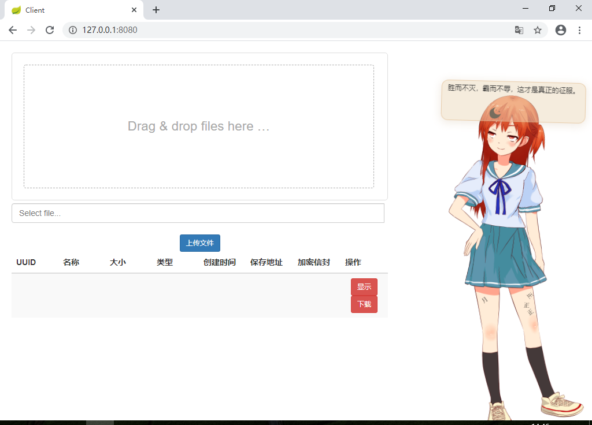
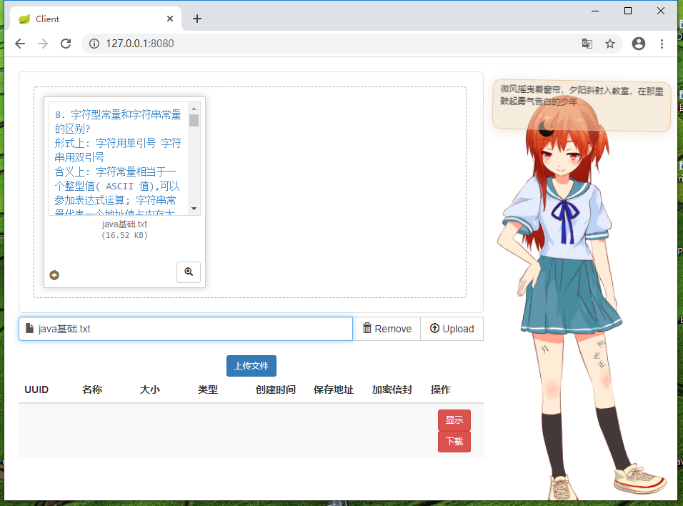
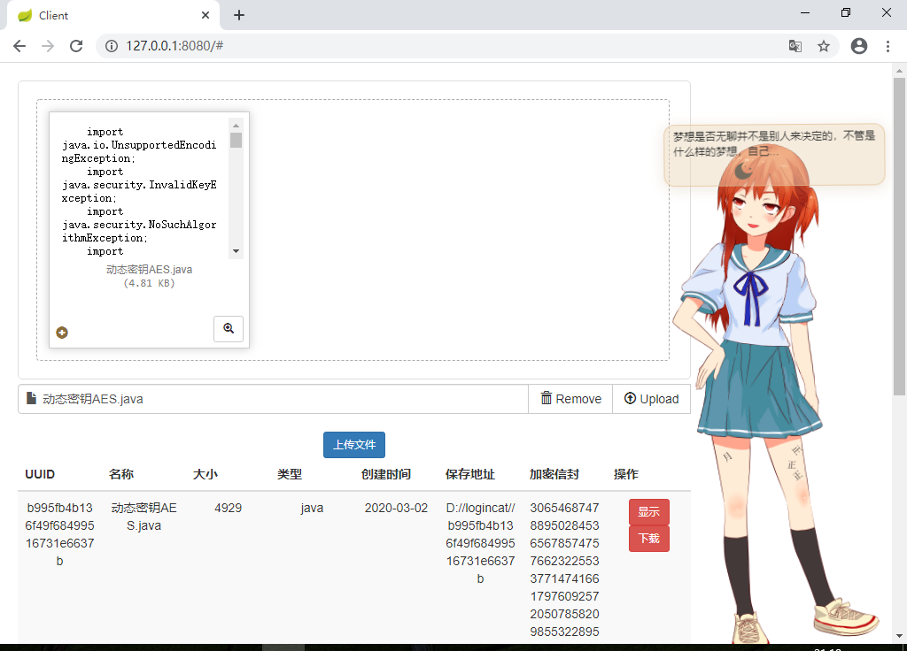
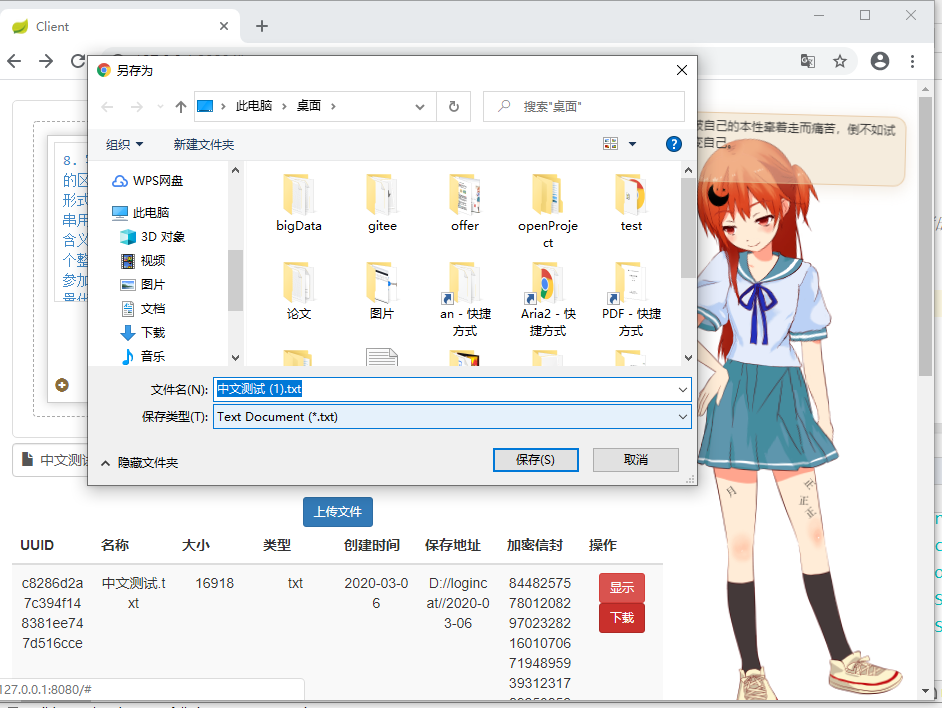

**没有图片的md是没有灵魂的**










**项目构建日志**

```
2-29 第一天
1.搭建起Server端和Client端 实现 Client 提交表单数据到 Server 端
2.编写Bean层的实体模型
3.自上而下 先完成controller层的编写 然后 完成需要的 Service接口 再去写Service的实现类  然后写数据的持久层
4.完成AES的加密解密 完成RSA的加密解密 签名验签
今日份总结：
maven不熟悉 在解决依赖时 走了弯路
Ajax 大部分都已经遗忘
对于AES RAS完全不熟悉 以及 对IO文件流操作的不熟悉
附加：晚上加上了derby嵌入 做了数据库连接的封装 测试了插入语句 属性有些多
connect 'jdbc:derby:EmbeddedDB;create=true';
CREATE TABLE filematainfo(
    id INTEGER NOT NULL GENERATED BYDEFAULT AS IDENTITY (START WITH 1, INCREMENT BY 1) primary key,
    uuid VARCHAR(1024) NOT NULL,
    name VARCHAR(1024) NOT NULL,
    size INTEGER NOT NULL,
    type VARCHAR(32) NOT NULL,
    createtime DATE NOT NULL,
    savefileaddr VARCHAR(1024) NOT NULL,
    fileencrypt VARCHAR(1024) NOT NULL,
);

3-1第二天
1.封装了derby数据库的连接和关闭
2.定义sql操作语句
3.封装了AES加密算法 以及RSA算法 修改了一些步骤
今日总结：对数据库操作的sql不是很熟练 加密算法中还有些对文件处理的过程需要去温习下IO流处理

3-2第三天
1.写好fileClient端的访问接口映射 重写http连接 采用 restTemplate进行fileClient 与 FileServer之间的通信 
2.使用thymeleaf进行前端渲染 使用bootstrap 进行样式设计 
3.使用bootstrap-fileInput插件 美化文件上传操作
4.加入鼠标点击特效 和live2D看板娘 进一步美化
今日份总结：前端的美化之路 真的永无止境啊 对thymeleaf不是很熟悉 需要加强

3-3第四天
1.对项目进行测试 
2.解决中文乱码 对文件名乱码最终采用 添加属性方式
3.封装重复代码 删除不必要的注释

3-4第五天
1.进一步完善项目
2.学习使用github-Desktop工具准备上传代码
3.考虑网络问题后使用码云

```

**项目构建中遇到的问题**

1.当在同一个项目下 同时开启 server和 client时 会出现 无法启动的情况

```
解决：开一个maven的父工程April 然后分别配置依赖
```

2.maven 子模块无法 继承 springboot 父工程

```xml
解决：
<dependencyManagement>
    <dependencies>
        <dependency>
            <!-- Import dependency management from Spring Boot -->
            <groupId>org.springframework.boot</groupId>
            <artifactId>spring-boot-dependencies</artifactId>
            <version>1.5.7.RELEASE</version>
            <type>pom</type>
            <scope>import</scope>
        </dependency>
    </dependencies>
    </dependencyManagement>
<build>
    <plugins>
        <plugin>
            <groupId>org.springframework.boot</groupId>
            <artifactId>spring-boot-maven-plugin</artifactId>
			<version>1.5.7.RELEASE</version>
            <executions>
                <execution>
                    <goals>
                        <goal>repackage</goal>
                    </goals>
                </execution>
            </executions>
        </plugin>
    </plugins>
</build>
```
3.spring-boot-maven-plugin插件无法解析
解决：

```xml
在settings.xml 的 <profiles></profiles>中添加 以下
<pluginRepositories>  
      <pluginRepository>  
        <id>spring plugins</id>  
        <name>Spring plugins</name>  
        <url>https://maven.aliyun.com/repository/spring-plugin</url>  
        <layout>default</layout>  
        <snapshotPolicy>always</snapshotPolicy>  
      </pluginRepository>  
</pluginRepositories>
```

4.thymeleaf 解析html template时失败

```
css/js/img等直接放在resources/static文件夹下，页面放在resources/templates下
并在html中加入<html xmlns:th="http://www.thymeleaf.org"> 变成模板
```

5.springboot static 文件获取不到

```java
解决：需要配置如下的静态资源映射才能直接把static/当成根路径访问
@EnableAutoConfiguration 会启用自动配置类 WebMvcAutoConfiguration
或者自己写
@Configuration
public class WebMvcConfig extends WebMvcConfigurerAdapter {
    @Override
    public void addResourceHandlers(ResourceHandlerRegistry registry) {
        //配置静态资源处理
        registry.addResourceHandler("/static/**")
                .addResourceLocations("classpath:/resources/", "classpath:/static/");
    }
}
```

6.跨域问题

```
先在磁盘上新建一个文件夹eg:  C:\MyChromeDevUserData
 --disable-web-security --user-data-dir=C:\MyChromeDevUserData 
再在chrome的快捷方式的属性中 在目标 后面追加 上面这条 再重新打开谷歌浏览器
```

7.UUID

```java
java.util.UUID.randomUUID().toString().replaceAll("-","");
```

8.RSA非对称加密算法 

```
公钥在server 私钥在client
公钥加密、私钥解密、私钥签名、公钥验签
```

8-2.AES对称加密算法

```
密钥key 就是类似现实生活中的钥匙 用钥匙去锁门 再用钥匙去开门
```

8-3项目加密流程

```
随机的钥匙key

AES (key,file) ->加密后的文件 FILE
RSA(公钥,key) -> 加密后的钥匙 并保存再数据库中 叫做 fileEncrpt
RSA(私钥 ，fileEncrpt) -> 解密钥匙 可以理解为 还原 key
AES(key,FILE) -> 解密文件 file

8-4项目验证流程
client随机生成SID
RSA(私钥，SID)->签名 signature
RSA(公钥，signature)->验签

一般来说RSA算法 是客户端生成钥匙对 然后将公钥发给服务器
```


9.获取resource下的文件路径

```java
src/main/resources/文件名称
this.getClass().getClassLoader().getResource("rsa_pub").getPath();

//公钥地址
    private static final String rsa_pub_addr = System.getProperty("user.dir")+File.separator+
            "AprilServer"+File.separator+"src" +File.separator+
            "main"+File.separator+"resources"+File.separator+"rsa_pub";
    //私钥地址
    private static final String rsa_addr = System.getProperty("user.dir")+File.separator+
            "AprilClient" +File.separator+ "src" +File.separator+ "main"+File.separator+
            "resources"+File.separator+"rsa";

System.getProperty("user.dir") //读取项目路径
```

10.Try-with-resources are not supported at language level '5'

```xml
在pom文件中加入下面语句
<build>
        <plugins>
            <plugin>
                <groupId>org.apache.maven.plugins</groupId>
                <artifactId>maven-compiler-plugin</artifactId>
                <configuration>
                    <source>8</source>
                    <target>8</target>
                </configuration>
            </plugin>
        </plugins>
</build>
```

11.Controller层向前端传值

```html
controller下弄个这个
Model model
model.addAttribute("X_SID",X_SID);
然后前端接收
Namespace 'th' is not bound  
<html lang="en" xmlns:th="http://www.w3.org/1999/xhtml">
法一：
<input id="websocketUrl" type="hidden" th:value="${websocketUrl}" />
$("#websocketUrl").val();
法二：
<script th:inline="javascript">
/*<![CDATA[*/
    var message = [[${message}]];
    console.log(message);
/*]]>*/
</script>
```

12.将带有 , 的字符串删掉 ， 并存为byte数组 这样才不会改变签名数组

```java
public  byte[] getByte(String str){
int wn = 0;
for(int i = 0; i < str.length(); i++){
	if(str.charAt(i) == ','){wn++;}
}
wn++;
byte[] reByte = new byte[wn];
for(int i = 0; i < wn; i++){
	if( i != (wn - 1)){//16是代表16进制 默认10进制
		reByte[i] = (byte) Integer.valueOf(str.substring(0, str.indexOf(",")), 16).intValue();
		str = str.substring(str.indexOf(",") + 1, str.length());
	}else{
		reByte[i] = (byte) Integer.valueOf(str, 16).intValue();
	}
}
return reByte;
}
```

13.将css 以及js等文件导入到idea中 有时会提示找不到资源 

```
解决：重启idea
```

14.jq给指定id赋值

```js
$("#uuid")[0].innerHTML = "123"; 需要 加[0]变成原始对象
```

15.IO对象流 invalid stream header ：

```java
//读公钥		
FileInputStream fis = new FileInputStream(rsa_pub_addr);
BufferedInputStream bis = new BufferedInputStream(fis);
ObjectInputStream ois = new ObjectInputStream(bis);
RSAPublicKey publicKey = (RSAPublicKey) ois.readObject();
ois.close();
bis.close();
fis.close();
//之前没有加缓冲流 导致无法读指定目录的 rsa 和 rsa_pub 只能读取 磁盘根目录的
    //加了缓冲流之后 由于可能文件在 复制粘贴 中出现问题 导致文件异常
    //最好是重新生成 密钥对 网上的解释都是说序列化 
```

